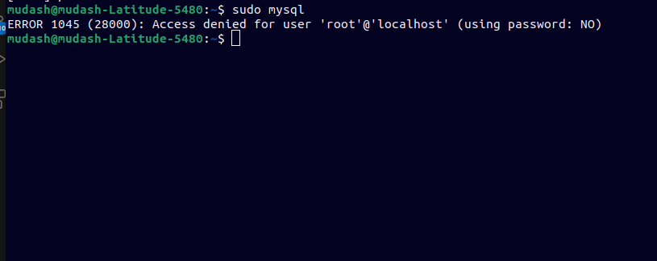

The only challenged faced during the set-up of my development environment is the MySQL extension. This is because of using the terminal in the installation process hence some commands were difficult to use while some did not work.

Nevertheless, I was finally able to find a solution and install MySql on my Ubuntu Os.
The following links were used:

- https://10web.io/blog/error-1045-mysql/
- https://phoenixnap.com/kb/access-denied-for-user-root-localhost
- https://phoenixnap.com/kb/install-mysql-ubuntu-22-04
- https://www.digitalocean.com/community/tutorials/how-to-install-mysql-on-ubuntu-22-04
- https://phoenixnap.com/kb/how-to-reset-mysql-root-password-windows-linux
- https://linuxhandbook.com/nano-save-exit/
