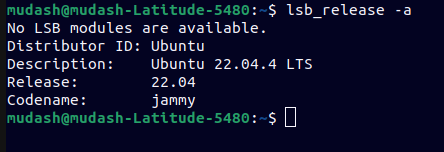

The following document details the setup process of my software development environment ie tools and technologies used.

# Operating System - Ubuntu 22.04 LTS

I followed the below guide on how to install the Ubuntu OS on my DELL Laptop.
https://ubuntu.com/tutorials/install-ubuntu-desktop#1-overview

The following are reasons I chose to install a linux based OS over Windows 11:

- It is an open source software.
- Users do not need to purchase any license.
- Has much more privacy-focused than Windows 11.
- Consumes less resources ie CPU memory.

Below is an image showing Ubuntu version successfully installed on my laptop:

# Text Editor - Visual Studio Code

Following the guide in this link, https://code.visualstudio.com/docs/setup/linux , I was able to install VsCode through Ubuntu's Snap Store.

See the images below:

# Version Control System - Git

For this Ubuntu , already has a pre-installed git, however it needs to be updated.
The following are the commands I used to perform this:

- sudo apt-add-repository ppa:git-core/ppa
- sudo apt-get update
- sudo apt-get install git
- git --version

Visit this link for additional information: https://askubuntu.com/questions/568591/how-do-i-install-the-latest-version-of-git-with-apt

# Python 3

For this Ubuntu , already has a pre-installed python3 from the apt package manager, however it needs to be updated as per the python official guide.

I followed the links below to upgrade the existing python3 version(3.10.12) to the latest which is (3.12.4).

- https://phoenixnap.com/kb/how-to-install-python-3-ubuntu
- https://www.python.org/downloads/release/python-3124/

# MySQL Database

Following the below link, https://phoenixnap.com/kb/how-to-check-mysql-version , check if there is an existing mysql in ubuntu 22.04, using the command " mysql -V " .
Using the below link , https://phoenixnap.com/kb/install-mysql-ubuntu-22-04, i was able to install mysql on Ubuntu Os.

# Extension and Plugins

The following are additional extensions ansd plugins present in my vs code editor.

- Dart
  
- Flutter
  
- Prettier Code Formatter
  
- Vs Code Color Picker
  
- Live Server
  
